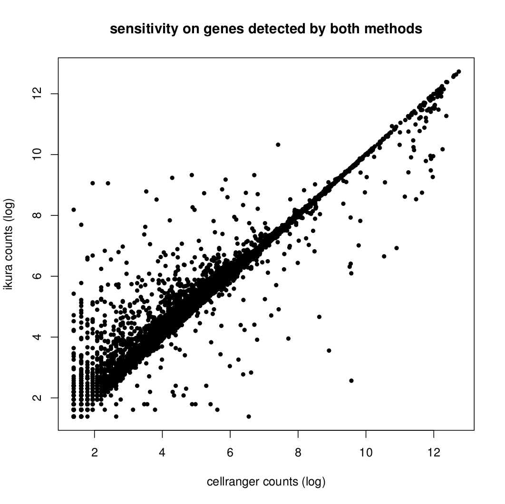
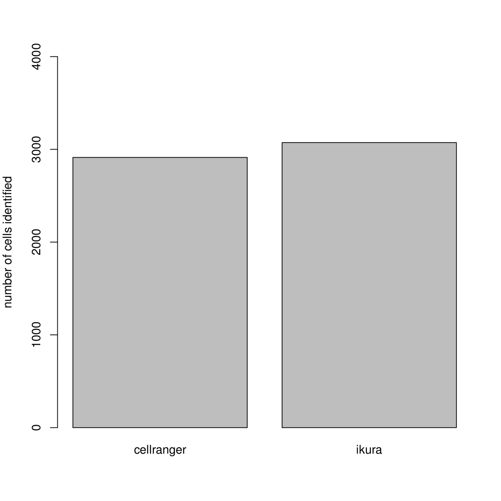
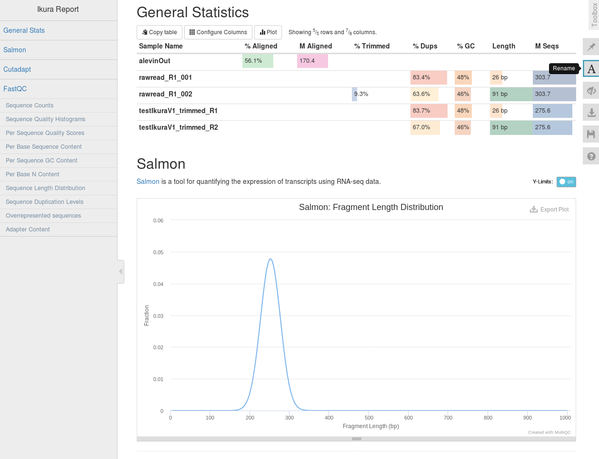

## Ikura:

A pipeline for primary analysis of single cell experiments: quality controls and trimming, demultiplexing, cell calling and transcript quantification. This version support experiments from 10x 3' libraries.

Ikura creates outputs reports and expression matrices in convenient formats. Particularly expression outputs are similar to cellranger v2, and integrate well with existing pipelines and popular downstream analysis tools (eg. Seurat).

Analyses can be performed on any laptop or desktop, and are typically achieved within 3-4 hours (3k-8k cells, with 4 Gb of RAM and 8 CPU cores), and  takes only 1 hour without any quality trimming.

For an exact reproductibility with the article (under review), see the corresponding git branch.


## Key interests

* fast and resource-efficient, no need of hi-performence computing cluster
* detailed quality controls and reports
* quality-trimming of fastq files
* performant cell calling
* sensitive transcript quantification:

In our datasets, Ikura shows improved sensitivity in transcript quantification, particularly with highly-conserved genes (eg. chemokines or chemokine receptors). It also performs an efficient cell calling with uniform sequencing depth, excluding cells with low number of UMI that could be hardly classified in downstream analyses.




## Getting Started

```bash
$ ./ikura --help

Ikura v1.0
Usage:	./ikura	[-q|--no-fastq-check] (optional)
		[-1|--read1] <read1>
		[-2|--read2] <read2>
		[-n|--expectedCells] <expectedCellNb>
		[-o|--output] <samplePrefix>
		[-i|--index] <salmonIndex>
		[-g|--txp2gene] <txp2gene>
		[-t|--threads] <coresNb> (optional, default is 10)

	NOTE: files should be specified as absolute paths.
	Ikura creates an output directory where the command is executed.

```


## Sample QC report output




## And after?

If work on T-cells or B-cells, you might be interested by Ikura's companion tool: [Tobiko](https://github.com/juugii/Tobiko).

## Prerequisites

Ikura is compatible with any PoSIX system, and has been tested on 64-bits Linux OS (CentOS 7, Debian 9, Ubuntu 18.04 LTS) and MacOSX.
It has the following dependencies: python>=3.6.5, R>=3.5.0, salmon>=0.11.1, awk, umi_tools>=0.5.4; fastq QC and precleaning require fastqc>=0.11.7, multiqc>=1.5 & cutadapt>=1.18


## Installing

First, install [salmon](https://github.com/COMBINE-lab/salmon) >= 0.11 and [fastqc](https://www.bioinformatics.babraham.ac.uk/projects/fastqc) >= 0.11.7 on your system. You will also need to have R (>=3.5.0 preferred) and python>=3.6.5 installed.

For Ikura to work out-of-the-box, all of these softwares should be directly callable, so add them to your path. Alternatively, you can edit manualy the 'dependencies.txt' file to integrate Ikura to your system. In case of any bad configuration, Ikura will warn you.

## Citation


